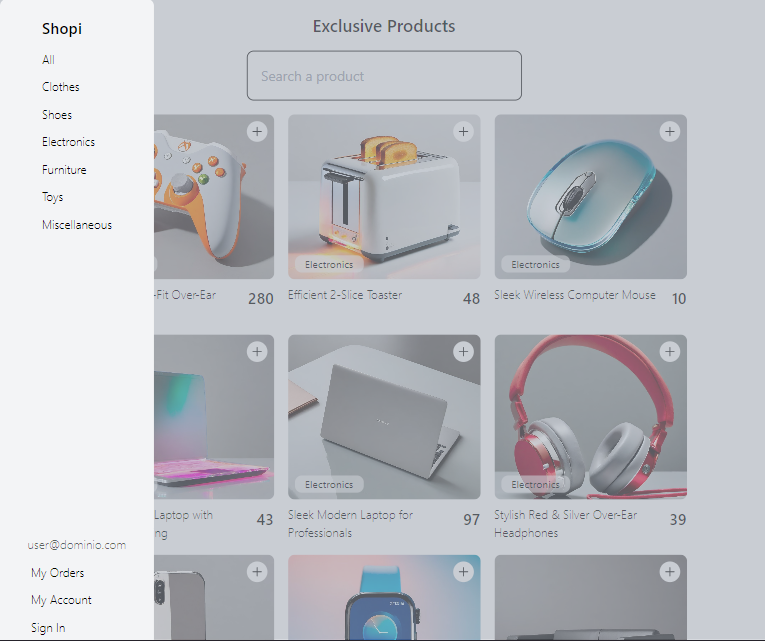
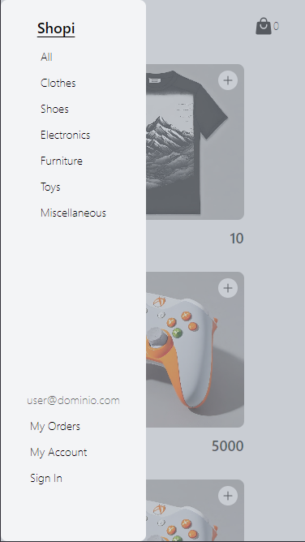
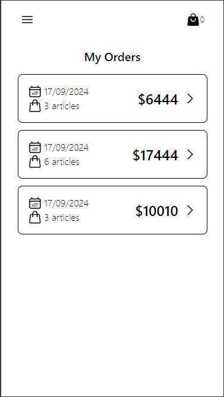

# Endless Shopping

### It is a web application that simulates shopping in an infinite way using an API.
- You can see a list of different products available for purchase, including details such as title, price, and description.
- You can select any of them, view the total sum, and proceed to the checkout to create an order.
- You can repeat the process to simulate as many different orders as you want.
- You can remove products from the shopping list.
- It includes various filtering options for grouping or searching based on specific text.

### Demo: [PAGES](https://billyagr.github.io/endless-Shopping/)

### Characteristics:
- **🗑️ Deletion:** Remove items from the shopping cart.
- **✅ Create Order:** Generate a list of purchased products.
- **🗂️ Group Orders:** Organize a list of placed orders.
- **🔍 Filter by Text:** Search for products based on matching text.
- **📦 Local Storage:** Save user profiles to maintain data even after closing the app.
- **📱 Responsive Design:** Adapt to different devices for an optimal user experience.

## Screenshot

### Movil





## Getting started 🚀

_These instructions will allow you to get a working copy of the project on your local machine for development and testing purposes._

### Installation

> [!IMPORTANT]
> You need to have NodeJS, NPM and GIT already installed (and updated in versions) on your machine.

First of all, you should clone or download (.zip) the project repository as follows:

```bash
  git clone https://github.com/MarkoTeixido/react-shopi.git
```
 
Now that you have the project, you have to open it in your code editor and in the terminal, install the dependencies as follows:

```bash
  npm install
```

### Deployment

To deploy the project locally: 

```bash
  npm run dev
```

# React + Vite

This template provides a minimal setup to get React working in Vite with HMR and some ESLint rules.

Currently, two official plugins are available:

- [@vitejs/plugin-react](https://github.com/vitejs/vite-plugin-react/blob/main/packages/plugin-react/README.md) uses [Babel](https://babeljs.io/) for Fast Refresh
- [@vitejs/plugin-react-swc](https://github.com/vitejs/vite-plugin-react-swc) uses [SWC](https://swc.rs/) for Fast Refresh
